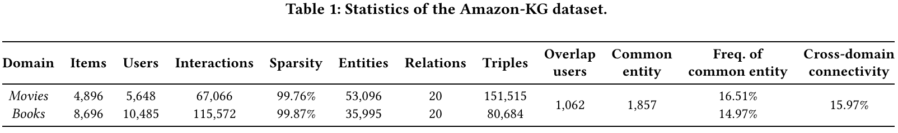

# Amazon-KG (v2.0) dataset

The Amazon-KG dataset is a KG-enhanced cross-domain recommendation dataset, which is constructed based on the widely used dataset [Amazon](https://nijianmo.github.io/amazon/index.html) and the well-known KG [DBpedia](http://dbpedia.org), aiming to introduce KG for cross-domain linking and knowledge enhancement. We select two popular domains in cross-domain recommendations, *Books* and *Movies\_and\_TV* (denoted as *Movies* below for brevity). 

We present the statistics of the dataset in the following table:



## Publication
We publish details of how to retrieve knowledge graphs based on recommendation data in the paper entitled "**Amazon-KG: Knowledge Graph Enhanced Cross-Domain Recommendation Dataset**"[[1]](#1). The paper has been accepted for presentation at the [SIGIR 2024 conference](https://sigir-2024.github.io/program_papers.html). Thank you for your support and citation!

## Motivation
Most of the existing cross-domain recommendation studies utilize user-item interactions (e.g., ratings and clicks), while the few studies that considered side information only analyze tags and reviews, which shows that the CDR community has the potential to make further progress in the exploration of auxiliary information. Since Encyclopedic knowledge graphs(KG) contain general information covering various domains and their structured format of data helps to reduce manual processing. Therefore, we build a KG-enhanced cross-domain recommendation dataset, named Amazon-KG, based on the widely used Amazon dataset for CDR and the well-known knowledge graph DBpedia. We believe that datasets like Amazon-KG facilitate the development of knowledge-aware cross-domain recommender systems.

## Data Format
To facilitate further research work, we processed the data into the Atomic Files format aligned with Recbole [[2]](#2) (a popular library containing multiple recommendation algorithms). Each domain contains three separate files in the following format:

| Suffix | Content | Format |
|---|---|---|
| *.inter* | User-item interaction | user_id, item_id, rating |
| *.kg* | Triplets in a knowledge graph | head_entity_id, relation_id, tail_entity|
| *.link* | Item-entity linkage data | item_id, entity_id|


## Licence
By using the datasets, you must agree to be bound by the terms of the following license.
```
License agreement
This dataset is made freely available to academic and non-academic entities for non-commercial purposes such as academic research, teaching, scientific publications, or personal experimentation. Permission is granted to use the data given that you agree:
1. That the dataset comes “AS IS”, without express or implied warranty. Although every effort has been made to ensure accuracy, we do not accept any responsibility for errors or omissions. 
2. That you include a reference to the Amazon-KG(v2.0) dataset in any work that makes use of the dataset. 
3. That you do not distribute this dataset or modified versions. It is permissible to distribute derivative works in as far as they are abstract representations of this dataset (such as models trained on it or additional annotations that do not directly include any of our data) and do not allow for a recovery dataset or something similar in character.
4. That you may not use the dataset or any derivative work for commercial purposes as, for example, licensing or selling the data, or using the data with the purpose of procuring a commercial gain.
```
## References
<a id="1">[1]</a> Yuhan Wang, Qing Xie, Mengzi Tang, Lin Li, Jingling Yuan, and Yongjian Liu. 2024. Amazon-KG: A Knowledge Graph Enhanced Cross-Domain Recommendation Dataset. In Proceedings of the 47th International ACM SIGIR Conference on Research and Development in Information Retrieval (SIGIR '24). Association for Computing Machinery, New York, NY, USA, 123–130. https://doi.org/10.1145/3626772.3657880
<a id="2">[2]</a> Wayne Xin Zhao, Shanlei Mu, Yupeng Hou, Zihan Lin, Yushuo Chen, Xingyu Pan, Kaiyuan Li, Yujie Lu, Hui Wang, Changxin Tian, Yingqian Min, Zhichao Feng, Xinyan Fan, Xu Chen, Pengfei Wang, Wendi Ji, Yaliang Li, Xiaoling Wang, and Ji-Rong Wen. 2021. RecBole: Towards a Unified, Comprehensive and Efficient Framework for Recommendation Algorithms. In Proceedings of the 30th ACM International Conference on Information &amp; Knowledge Management (CIKM '21). Association for Computing Machinery, New York, NY, USA, 4653–4664. https://doi.org/10.1145/3459637.3482016
